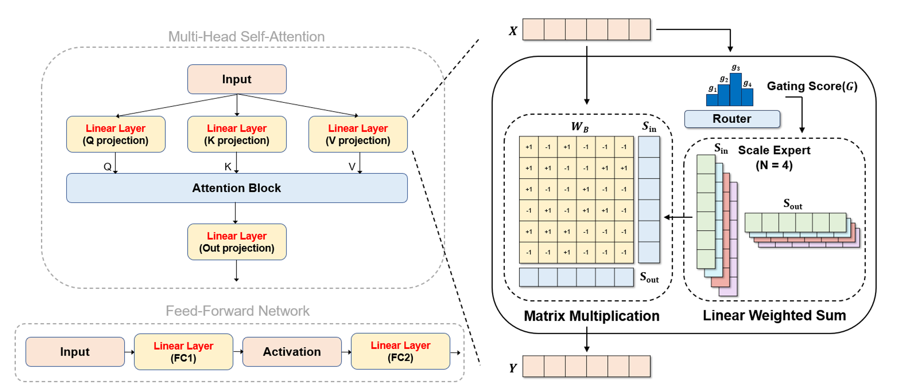
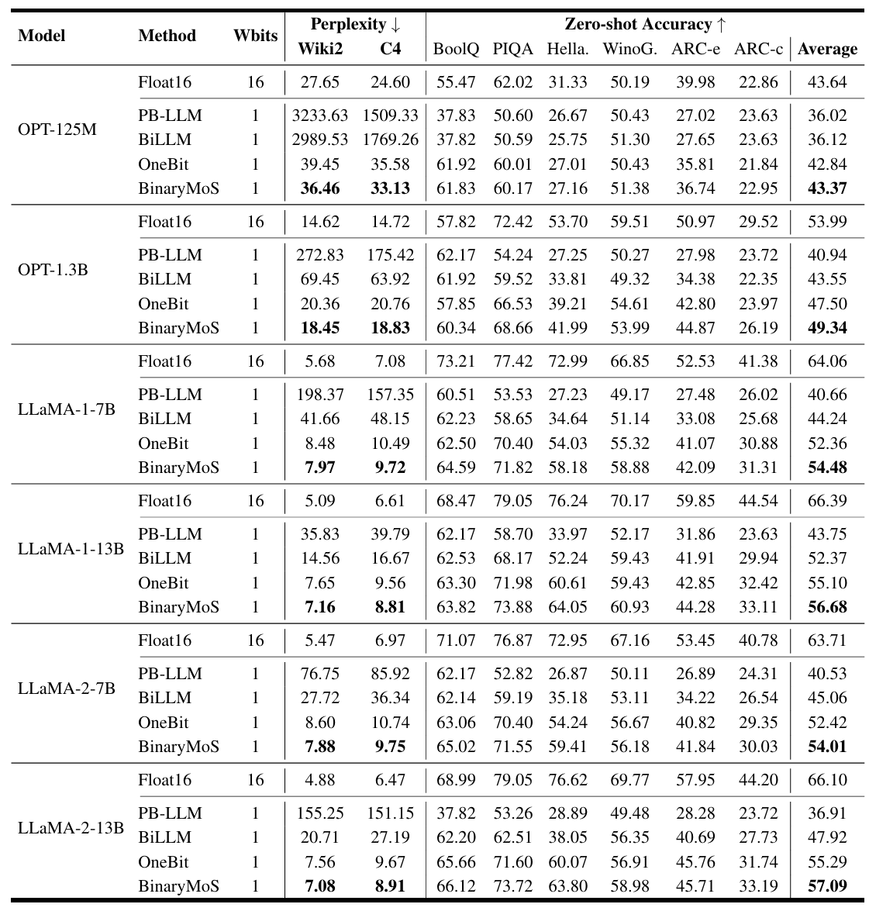

# Mixture of Scales: Memory-Efficient Token-Adaptive Binarization for Large Language Models

<p align="middle">
    <a href="https://arxiv.org/abs/2406.12311"></a>
</p>

<div align=center>

</div>


This is the official repository of **"Mixture of Scales: Memory-Efficient Token-Adaptive Binarization for Large Language Models"** accepted to **NeurIPS 2024**. 


* Unlike conventional methods, BinaryMoS employs multiple scaling experts for binary weights, dynamically merging these experts for each token to adaptively generate scaling factors.
* Token-adaptive scaling factor boosts the representational power of binarized LLMs with minimal memory overhead.
* Our experimental results reveal that BinaryMoS surpasses conventional binarization techniques in various natural language processing tasks and even out performs 2-bit quantization methods.
  
## Usage

### 1. Installation
Install the requirements package.
```
conda create -n BinaryMoS python=3.9
conda activate BinaryMoS
cd BinaryMoS
pip install -r requirements.txt
```
### 2. Training
Train the binarized model using QAT with BinaryMoS approach. (Only llama is supported)
```
CUDA_VISIBLE_DEVICES={device} python -m main \
--model_id {model name or path} \
--dataset {c4 or wikitext2 or c4_wiki} \
--save_dir {save_path} \
--num_train_epoch {epoch} \
--per_device_train_batch_size {batch_size} \
--lr {learning rate} 
```
### 3. Evaluation
Evaluate the BinaryMoS model on zeroshot task (BoolQ, PIQA, Hellaswag, Winogrande, ARC-e, ARC-c) and PPL task (Wikitext2, C4).
```
CUDA_VISIBLE_DEVICES={device} python -m evaluate \
--model_id {BinaryMoS model name or path}
```
## Results

### 1. Average Zeroshot Accuracy & Perplexity

<div align=left>

</div>

You can reproduce the results, downloading the pretrained BinaryMoS models at [Huggingface](https://huggingface.co/dongwonjo). 

## Pretrained Models
We provide the pretrained BinaryMoS models for **LLaMA-1-7B/13B/30B and LLaMA-2-7B/13B**.

You can download the pretrained models through [Huggingface](https://huggingface.co/dongwonjo) and check the evaluation results.

Example:
```
import torch
from transformers import AutoTokenizer
from models.modeling_llama import BinaryMoSForCausalLM
from evaluate import evaluate_model

tokenizer = AutoTokenizer.from_pretrained("dongwonjo/Llama-2-7B-BinaryMoS-E4", device_map="auto", use_fast=False, trust_remote_code=True)
model = BinaryMoSForCausalLM.from_pretrained("dongwonjo/Llama-2-7B-BinaryMoS-E4", device_map="auto", torch_dtype=torch.float16)

zeroshot_task = "boolq,piqa,hellaswag,winogrande,arc_easy,arc_challenge"
ppl_task = "wikitext2,c4"
results = evaluate_model(model, tokenizer, tasks=zeroshot_task, eval_ppl=ppl_task)
```

## Citation
If you use the BinaryMoS approach in your research,  please consider citing:

```
@article{BinaryMoS,
  title={Mixture of Scales: Memory-Efficient Token-Adaptive Binarization for Large Language Models},
  author={Dongwon Jo, Taesu Kim, Yulhwa Kim, Jae-Joon Kim},
  journal={arXiv preprint arXiv:2406.12311},
  year={2024}
  }
```
